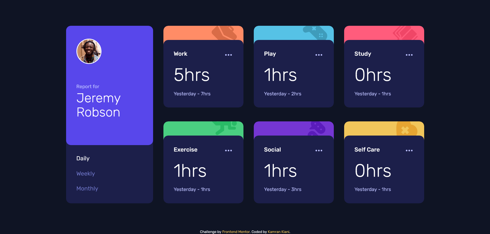

# Frontend Mentor - Time tracking dashboard solution

This is a solution to the [Time tracking dashboard challenge on Frontend Mentor](https://www.frontendmentor.io/challenges/time-tracking-dashboard-UIQ7167Jw).

## Table of contents

- [Overview](#overview)
  - [The challenge](#the-challenge)
  - [Screenshot](#screenshot)
  - [Links](#links)
- [My process](#my-process)
  - [Built with](#built-with)
  - [What I learned](#what-i-learned)
  - [Continued development](#continued-development)
  - [Useful resources](#useful-resources)
- [Author](#author)
- [Acknowledgments](#acknowledgments)

## Overview

### The challenge

Users should be able to:

- View the optimal layout for the site depending on their device's screen size
- See hover states for all interactive elements on the page
- Switch between viewing Daily, Weekly, and Monthly stats

### Screenshot

### Links

- Solution URL: [Github](https://github.com/kaamiik/fm-Time-Tracking-Dashboard)
- Live Site URL: [Vercel](https://fm-time-tracking-dashboard-mauve.vercel.app/)

## My process

### Built with

- Semantic HTML5 markup
- CSS custom properties
- Flexbox
- CSS Grid
- Mobile-first workflow
- Sass
- Cube CSS
- Vite
- Vanilla JS
- Fetch

### What I learned

- Using Flex and Grid to build the page.
- Working with Json file and practice fetching data
- Build **Tabbed Interface** and also **Link Cards**

## Author

- Frontend Mentor - [@kaamiik](https://www.frontendmentor.io/profile/kaamiik)
- Twitter - [@kiaakamran](https://www.twitter.com/kiaakamran)

## Acknowledgments

These two reference really helped me to build this challenge.

1. for building [Tabbed Interface](https://inclusive-components.design/tabbed-interfaces/)
2. For building a [card](https://inclusive-components.design/cards/) that you can click on it and be accessible
